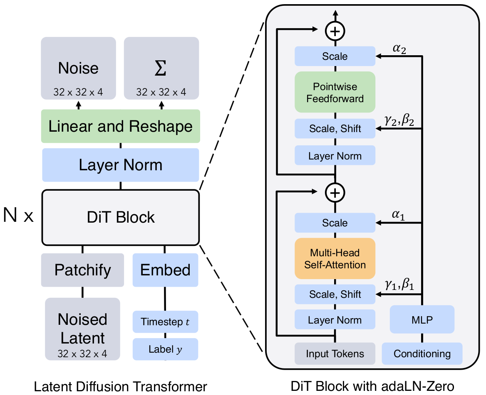

# Diffusion Transformer
Implementation of the Diffusion Transformer model in the paper:

> [Scalable Diffusion Models with Transformers](https://arxiv.org/abs/2212.09748). 

</img>

See [here](https://github.com/facebookresearch/DiT) for the official Pytorch implementation.


## Dependencies
- Python 3.9
- Pytorch 2.1.1


## Training Diffusion Transformer
Use `--data_dir=<data_dir>` to specify the dataset path.
```
python train.py --data_dir=./data/
```

## Hparams setting
Adjust hyperparameters in the `config.py` file.

Implementation notes:
- minDiT is designed to offer reasonable performance using a single GPU (RTX 3080 TI).
- minDiT largely follows the original DiT model.
- DiT Block with adaLN-Zero.
- Diffusion Transformer with [Linformer](https://arxiv.org/abs/2006.04768) attention.
- [EDM](https://arxiv.org/abs/2206.00364) sampler.
- [FID](https://arxiv.org/abs/1706.08500) evaluation.


## Licence
MIT
